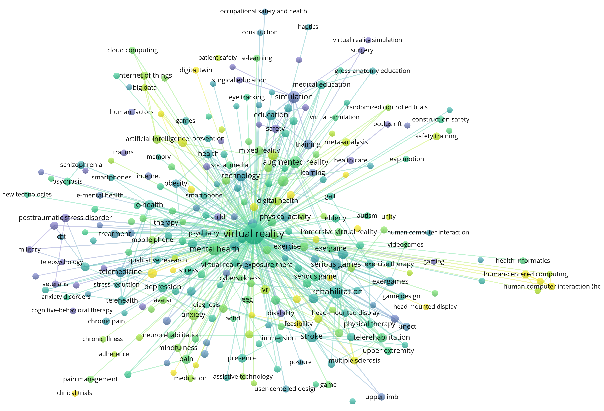

## Welcome to Project Health Metaverse

This is an open research project for building Health Metaverse, a virtual 3D world based on medical domain knowedge and healthcare services. 

[What is Metaverse?](word_clouds/what-is-metaverse.md)

[The Health Metaverse – A New Frontier?](https://coruzant.com/health-tech/the-health-metaverse-a-new-frontier/)

### Our Goals

- Provide a deeper understanding of what Health Metaverse is;
- Identify key technologies and applications in Health Metaverse;
- Facilitate the building of Health Metaverse based on existing information technology;
- Monitor challenges and research trends around Health Metaverse.

### Keywords around Health Metaverse

Figure generated by [VOSViewer](https://www.vosviewer.com/), Data from [Web of Science](https://www.webofknowledge.com/)

### Resources and Tools

- [News/Blogs](https://github.com/dhchenx/Health-Metaverse)

- [PyPI project](https://pypi.org/project/health-metaverse/)

- [Word Cloud](word_clouds/health_metaverse_wordcloud.md)

- Topic Models (Number of topics = [6](topic_models/health_metaverse_6.html)  [8](topic_models/health_metaverse_8.html) [10](topic_models/health_metaverse_10.html))

[Leave a feedback!](https://github.com/Health-Metaverse/health-metaverse.github.io/issues)

### Publications

Donghua Chen and Runtong Zhang. <a href="https://plu.mx/plum/a/?doi=10.2139%2Fssrn.3998068" data-popup="right" data-size="medium" class="plumx-plum-print-popup plum-bigben-theme" data-site="plum" data-hide-when-empty="true">Exploring Research Trends of Emerging Technologies in Health Metaverse: A Bibliometric Analysis</a> (January 5, 2022). Available at SSRN: http://dx.doi.org/10.2139/ssrn.3998068. [[Link]](http://dx.doi.org/10.2139/ssrn.3998068)

### Contributors

[Donghua Chen](https://github.com/dhchenx)

© 2022 Project Health Metaverse